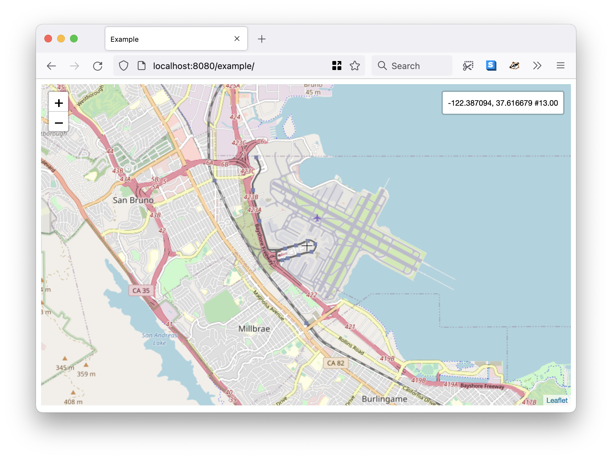

# leaflet-crosshairs-control



Leaflet control for displaying crosshairs in the center of the map and its coordinates in a `leaflet-bar` control element.

## Example

```
     var map = L.map("map");
     map.setView([37.61799, -122.370943], 13);

     var cr = new L.Control.Crosshairs({
	 coordinates: 'lonlat',
     });

     cr.addTo(map);
     
     var layer_url = "https://tile.openstreetmap.org/{z}/{x}/{y}.png";
     var layer_args = {};
     
     var layer = L.tileLayer(layer_url, layer_args);
     layer.addTo(map);
```

For a full working example consult [example/index.html](example/index.html).

## Options

The `L.Control.Crosshairs` constructor accepts the following options

### coordinates

A string indicating whether to display coordinates as lat, lon (y, x) or lon, lat (x, y). Valid options are:

* latlon
* lonlat

_Default is `latlon`._

### position

A string indicating where on the map element that coordinates should be drawn. Valid options are:

* bottomleft
* topleft
* topright
* bottomright

_Default is `topright`._

## See also

* https://leafletjs.com/